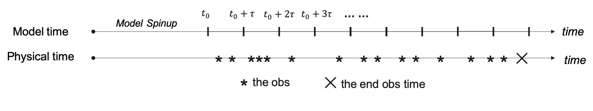
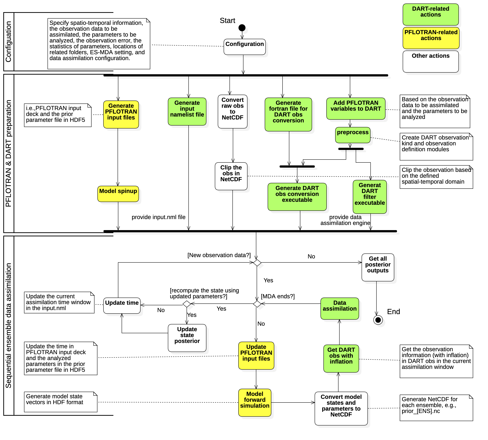

# PFLOTRAN-DART

This is an interface package for integrating [PFLOTRAN](www.pflotran.org) and [DART](https://www.image.ucar.edu/DAReS/DART/). This objective is to allow user to conduct data assimilation on PFLOTRAN by using DART utilities.

## Prerequisites

It requires the installation of PFLOTRAN, DART, and some Python packages.

### Install PFLOTRAN

Please refer to PFLOTRAN's official [instruction](https://www.pflotran.org/documentation/user_guide/how_to/installation/linux.html#linux-install). For [NERSC Cori](https://nersc.gov/) users, a detailed instruction is available at [here](https://github.com/pnnl-sbrsfa/how-to-guide/blob/master/Compile-PFLOTRAN-on-Cori.md). 

### Install DART

Please refer [here](./INSTALL_DART.md) for DART installation.

### Install other packages

- a Fortran 90 compiler
- [HDF5](https://www.hdfgroup.org/solutions/hdf5/) library 
- [NetCDF4](https://www.unidata.ucar.edu/software/netcdf/) library including the F90 interfaces 
- the C shell
- (optional) an MPI library
- The following Python pacakges:

```sh
f90nml >= 1.1.2
h5py >= 2.9.0
numpy >= 1.16.4
pandas >= 0.25.0
netcdf4-python >= 1.5.1.2
```

### Move the PFLOTRAN-DART repository into DART

Put the PFLOTRAN-DART repository in DART-compliant models repository by:

```sh
mv {PFLOTRAN-DART} {DART}/manhattan/models/pflotran
```


## File structure

The main structure of this {PFLOTRAN-DART} repository is shown below:

```
.
+-- README.md         # The README file for a general introduction
+-- INSTALL_DART.md   # The procedures of installing and configuring DART
+-- model_mod.F90     # The interface for linking PFLOTRAN and DART
+-- file_paths.nml    # The namelist files containing the locations of all the required files/repositories
|
+-- obs_kind/         # The repository containing the DEFAULT_obs_kind_mod.F90 file
+-- utils/            # The utility repository
+-- work/             # The repository containing shell scripts and compiling files
+-- figs/             # The figure repository
+-- applications/     # The application repository for running DART-PFLOTRAN
```

- ```model_mod.F90```: This file provides the Fortran interfaces for a minimal implementation of shaping PFLOTRAN as a DART-compliant model. A detailed introduction of the introduced Fortran interfaces can be found [here](https://www.image.ucar.edu/DAReS/DART/manhattan/models/template/model_mod.html).

- ```work```: The folder provides a set of scripts for integrating PFLOTRAN and DART. It includes (1) shell scripts for running PFLOTRAN with DART (i.e., ```run_filter.csh``` and ```advance_model.csh```); (2) the template for input namelists file (i.e., ```input.nml.template```); (3) the shell script for converting NetCDF observation data to [DART format](https://www.image.ucar.edu/DAReS/DART/DART2_Observations.html#obs_seq_overview) (i.e., ```dart_seq_convert.csh```); (4) the shell script for [check](https://www.image.ucar.edu/DAReS/DART/manhattan/assimilation_code/programs/model_mod_check/model_mod_check.html) ```model_mod.F90```  (i.e., ```check_model_mod.csh```); and (5) other mkmf files and path names files required by the previous shell scripts. 

- ```obs_kind```: The folder contains the ```DEFAULT_obs_kind_mod.F90``` defining a list of DART variable generic quantity, including PFLOTRAN's variables.

- ```utils```: This folder provides a set of utility scripts for DART format observation conversion, preparing DART's prior data in NetCDF format, modifying ```DEFAULT_obs_kind_mod.F90``` by adding new PFLOTRAN's variables, and preparing the input namelist file.

- ```applications``` This folder is where the applications should be put. A default ```template``` folder is provided, where the folder structure of each application should follow. An example of 1D thermal model is also provided in ```1dthermal``` folder. For running PFLOTRAN-DART, we suggest users to utilize the jupyter notebooks under ```workflow_ipynb``` to run through the work flow.

  


## Configuration

The following information are needed to configure the DART-PFLOTRAN for a specific application through the [jupyter notebook](./applications/workflow_ipynb/DART_PFLOTRAN_Integrate.ipynb):

- The locations of PFLOTRAN executable and mpirun
- The numbers of CPU cores used for PFLOTRAN and DART
- The application folder name
- The observation data to be assimilated and the PFLOTRAN parameters to be analyzed in DART
- The temporal information (see below)
- The data assimilation settings, which are configured through multiple [DART namelists](https://www.image.ucar.edu/DAReS/DART/manhattan/documentation/index.html#Namelists) in the input.nml file (e.g., [filter_nml](https://www.image.ucar.edu/DAReS/DART/manhattan/assimilation_code/modules/assimilation/filter_mod.html#Namelist) and [assim_tools_mod](https://www.image.ucar.edu/DAReS/DART/manhattan/assimilation_code/modules/assimilation/assim_tools_mod.html#Namelist))

For the temporal information, the model first spinup for a given period of time. Once the spinup is done, the model restarts with time t0, and begins to assimilate with fixed time window tau. Meanwhile, the actual observation time should be mapped to the model time start time t0.



## Implementation

TO BE ADDED.




## Contacts
Peishi Jiang (peishi.jiang@pnnl.gov), Xingyuan Chen (xingyuan.chen@pnnl.gov)