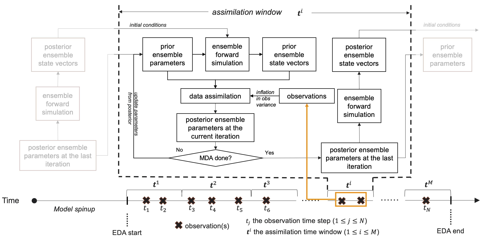
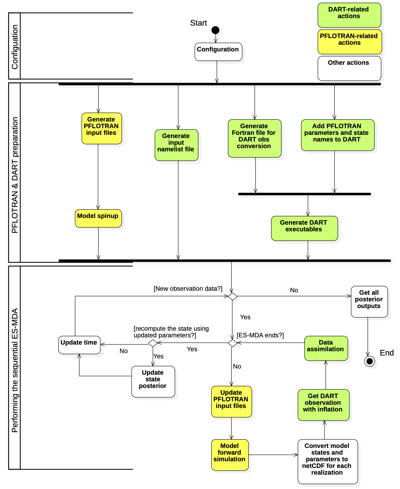

# DART-PFLOTRAN

This is an software framework for integrating [PFLOTRAN](www.pflotran.org) and [DART](https://www.image.ucar.edu/DAReS/DART/). The objective is to allow user to conduct ensemble data assimilation on PFLOTRAN by using DART assimilation engine.

**Jiang, P.**, X. Chen, K. Chen, J. Anderson, N. Nancy, T. Hoar, M. E. Gharamti (2021). DART-PFLOTRAN: An Ensemble-based Data Assimilation System for Estimating Subsurface Flow and Transport Model Parameters. Environmental Modeling and Software, *in prep*.

## Prerequisites

It requires the installations of several packages, PFLOTRAN, DART.

### Install packages
The following packages should be installed first. **Note that** it is recommended to install the Python packages and netCDF4 fortran interfaces using [conda virtual environment](./INSTALL_CONDA_VIRT_ENV.md) .

- a Fortran 90 compiler
- [C shell](https://www.grymoire.com/Unix/Csh.html)
- (optional because it can be installed through PFLOTRAN, see below) an MPI library
- [HDF5](https://www.hdfgroup.org/solutions/hdf5/) library
- [netCDF4](https://www.unidata.ucar.edu/software/netcdf/) library including the F90 interfaces and [NCO](http://nco.sourceforge.net/) utitlilies
- and the following Python3 pacakges:

|Packages | tested with version|
|:---:|:---:|
|f90nml |  1.1.2|
|h5py |2.9.0 |
|numpy|  1.16.4 |
|scipy| 1.6.0 |
|pandas| 0.25.0 |
|netcdf4-python| 1.5.1.2 |
|jupyter-core|4.5.0|

### Install PFLOTRAN

Please refer to PFLOTRAN's official [instruction](https://www.pflotran.org/documentation/user_guide/how_to/installation/linux.html#linux-install). For [NERSC Cori](https://nersc.gov/) users, a detailed instruction is available at [here](https://github.com/pnnl-sbrsfa/how-to-guide/blob/master/Compile-PFLOTRAN-on-Cori.md).

### Install DART

Please refer [here](./INSTALL_DART.md) for DART installation.

### Move the DART-PFLOTRAN repository into DART

Put the DART-PFLOTRAN repository in DART-compliant models repository by:

```sh
mv {DART-PFLOTRAN} {DART}/manhattan/models/pflotran
```


## Folder structure

The following is the the main structure of the {DART-PFLOTRAN} repository:

```
.
+-- README.md         # The README file for a general introduction
+-- INSTALL_DART.md   # The procedures of installing and configuring DART
+-- INSTALL_DEPENDENCIES.md  # The procedures of installing some requried packages
+-- model_mod.F90     # The interface for linking PFLOTRAN and DART
+-- file_paths.nml    # The namelist files containing the locations of all the required files/repositories
|
+-- smoother/         # The repository containing fortran files for conducting one-time smoother using DART utitlies
+-- obs_kind/         # The repository containing both the DEFAULT_obs_kind_mod.F90 file and obs_def_PFLOTRAN_mod.F90 FILE
+-- utils/            # The utility repository
+-- work/             # The repository containing shell scripts and compiling files
+-- figs/             # The figure repository
+-- applications/     # The application repository for running DART-PFLOTRAN
```

- ```model_mod.F90```: This file provides the Fortran interfaces for a minimal implementation of shaping PFLOTRAN as a DART-compliant model. A detailed introduction of the introduced Fortran interfaces can be found [here](https://www.image.ucar.edu/DAReS/DART/manhattan/models/template/model_mod.html).

- ```smoother```: This folder provides a set of scripts for ensemble smoother using DART utitlies. It includes (1) conducting smoother (i.e., , ```smoother_mod.f90``` -- revised from ```filter_mod.f90``` in DART; ```assim_smoother_tools_mod.f90``` -- revised from ```assim_tools_mod.f90``` in DART; and ```smoother.f90``` -- revised from ```filter.f90``` in DART); and (2) the corresponding test codes (i.e., ```model_mod_check.f90```, ```test_itnerpolate_threed_cartesian.f90```, and ```model_check_utilities_mod.f90``` -- all are revised from DART codes).

- ```work```: The folder provides a set of scripts for integrating PFLOTRAN and DART. It includes (1) shell scripts for running PFLOTRAN with DART (i.e., ```run_DART_PFLOTRAN.csh```); (2) the template for input namelists file (i.e., ```input.nml.template```); (3) the shell script for converting NetCDF observation data to [DART format](https://www.image.ucar.edu/DAReS/DART/DART2_Observations.html#obs_seq_overview) (i.e., ```dart_seq_convert.csh```); (4) the shell script for [check](https://www.image.ucar.edu/DAReS/DART/manhattan/assimilation_code/programs/model_mod_check/model_mod_check.html) ```model_mod.F90```  (i.e., ```check_model_mod.csh```); and (5) other mkmf files and path names files required by the previous shell scripts.

- ```obs_kind```: This folder provides the definitions of PFLOTRAN variables in DART and the corresponding utitlities required by DART, including: (1) ```DEFAULT_obs_kind_mod.F90``` defining a list of DART variable generic quantity (along with PFLOTRAN's variables) and (2) ```obs_def_PFLOTRAN_mod.F90``` defining some interfaces of observation definions and the mapping between PFLOTRAN variable names and their names in DART quantity.

- ```utils```: This folder provides a set of utility functions for DART format observation conversion, preparing DART's prior data in NetCDF format, modifying ```DEFAULT_obs_kind_mod.F90``` by adding new PFLOTRAN's variables, preparing the input namelist file, running PFLOTRAN, updating observation with inflation, and so forth.

- ```applications``` This folder is where the applications should be put. A default ```template``` folder is provided, where the folder structure of each application should follow. An example of 1D thermal model is also provided in ```1dthermal``` folder. For running PFLOTRAN-DART, we suggest users to configure and run the jupyter notebook or the corresponding python file under ```workflow_ipynb``` to run through the work flow.


## Configuration

The following information are needed to configure the DART-PFLOTRAN for a specific application through the [jupyter notebook](./applications/workflow_ipynb/DART_PFLOTRAN_Integrate.ipynb):

- General configuration
    - The locations of PFLOTRAN executable and mpirun (**note that** the mpirun should be within the same MPI system as the mpi90 used in [DART mkmf.template](./INSTALL_DART.md))
    - The numbers of CPU cores used for PFLOTRAN and DART
    - The application folder name
- The observation data and the model parameters
    - The observation data to be assimilated and the PFLOTRAN parameters to be analyzed in DART
    - The observation error and the associated types (i.e., relative and absolute errors)
    - The statistics of the parameters: (1) the value range; (2) the mean and std for random sampling; and (3) the distribution to be sampled (i.e., normal, truncated normal, and uniform distributions).
    - The list of parameters whose prior would be resampled based on the mean of the corresponding posterior at the previous time step.
    - The spatial-temporal domain of the observation data to be assimilated (see below)
- Other configurations
    - The mapping between physical/observation time and model time
    - DART data assimilation settings (configured through multiple [DART namelists](https://www.image.ucar.edu/DAReS/DART/manhattan/documentation/index.html#Namelists) in the input.nml file and [smoother_nml](./smoother/smoother_mod.html))

For the temporal information, the model spinup is conducted for a given period of time $t_0$. Once the spinup is done, the model restarts with time $t_0$, and begins to assimilate with time window $\bf{t}^i$ ($i=1,...,M$ where $M$ is the number of time windows). Meanwhile, the actual observation time should be mapped to the model time start time $t_0$.



## Implementation
Performing DART-PFLOTRAN is under ```./applications/workflow_ipynb``` through either Jupyter notebook (e.g., [```workflow.ipynb```](./applications/workflow_ipynb/workflow.ipynb)) or a corresponding Python script (e.g., [```workflow.py```](./applications/workflow_ipynb/workflow.py))




## Contacts
Peishi Jiang (peishi.jiang@pnnl.gov), Xingyuan Chen (xingyuan.chen@pnnl.gov)
